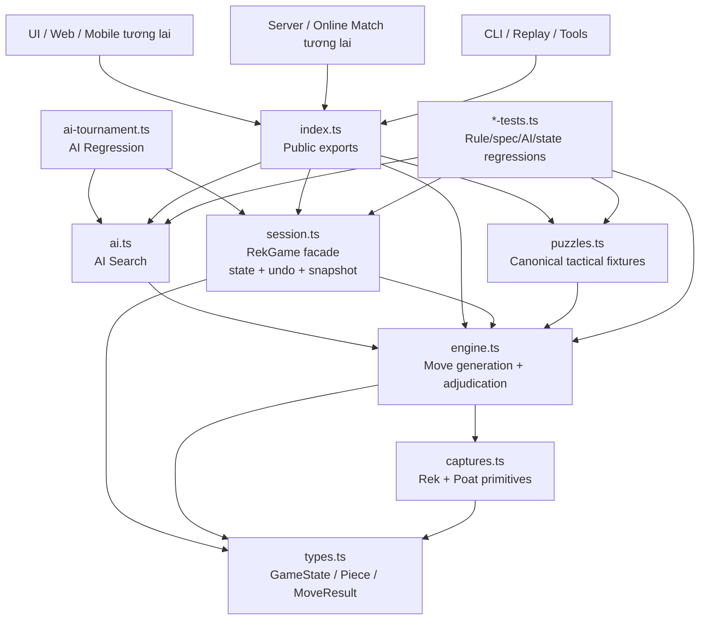
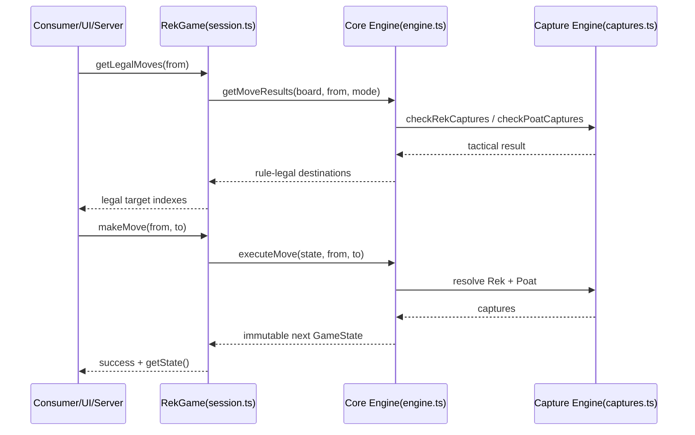
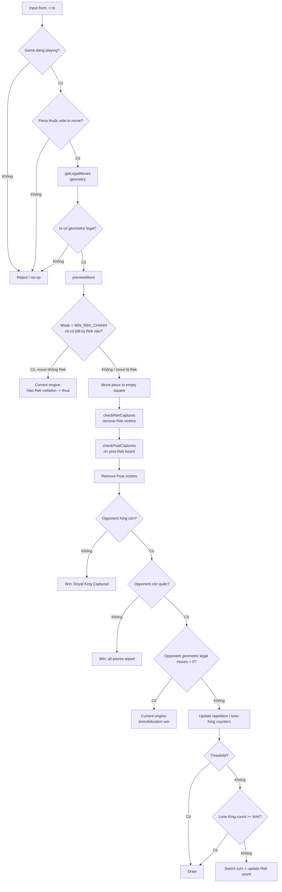
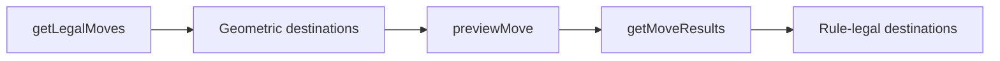
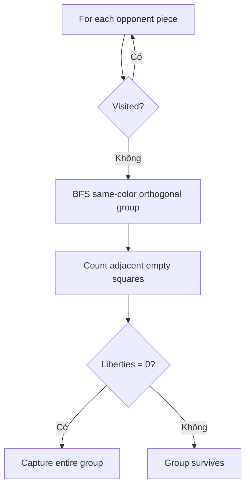
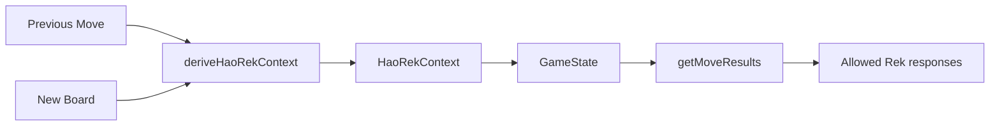
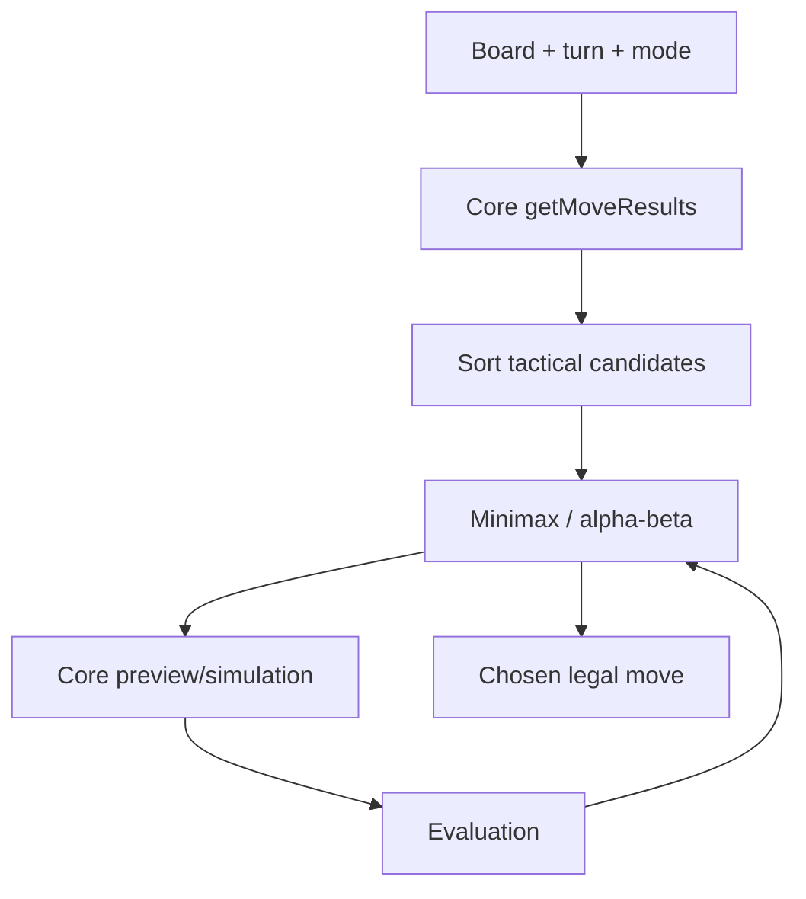
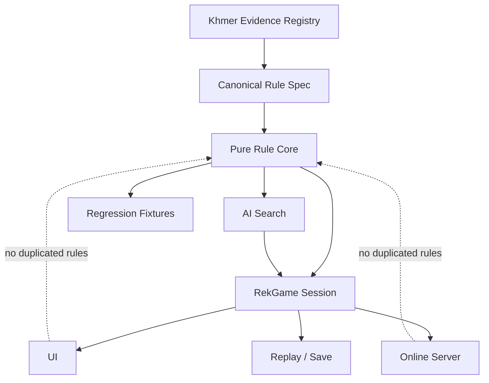

# SƠ ĐỒ GAME ENGINE REK KHMER

> **Repository:** `machxanht/Rek-Khmer-Chess`  
> **Mục tiêu:** mô tả kiến trúc engine hiện tại, đường đi của một nước cờ và ranh giới giữa **core rule**, **session**, **AI**, **tests** và các **rule còn chờ research**.

---

## 1. NGUYÊN TẮC KIẾN TRÚC

Engine phải có **một nguồn quyết định luật duy nhất**.

- UI/server/CLI về sau **không tự tính legal move, Rek, Poat, Hao Rek hay thắng/thua**.
- AI **không tự viết lại luật**; AI chỉ search trên tập move do core engine sinh ra.
- Session chỉ quản lý state/history/save-load; không được chứa luật bắt quân riêng.
- `HUONG_DAN_LUAT_CO_REK_KHMER.md` quản lý **evidence status**.
- `SPEC_ENGINE_CO_REK_KHMER.md` mô tả **technical contract mà code hiện chạy**.

---

## 2. SƠ ĐỒ MODULE HIỆN TẠI



### Trách nhiệm từng module

| Module | Chịu trách nhiệm | Không được làm |
|---|---|---|
| `types.ts` | Kiểu dữ liệu, `GameState`, `MoveResult` | Không phán luật |
| `captures.ts` | Primitive Rek và Poat | Không quản turn/history/AI |
| `engine.ts` | Setup, movement, preview, execute, terminal/draw | Không quản UI/network |
| `session.ts` | `RekGame`, undo, serialize/deserialize | Không tự định nghĩa capture |
| `ai.ts` | Search/evaluation trên legal moves từ engine | Không tự sinh luật riêng |
| `ai-tournament.ts` | Match harness + metrics | Không thay đổi rule |
| `puzzles.ts` | Thế cờ regression/teaching | Không bypass engine legality |
| `index.ts` | Public export surface | Không chứa business logic |

---

## 3. PUBLIC CALL FLOW KHUYẾN NGHỊ

Consumer nên đi qua `RekGame`:



**Quy tắc:** UI chỉ render kết quả. Nếu UI tự kiểm tra Rek/Poat/Hao Rek thì kiến trúc đã bị phá.

---

## 4. PIPELINE MỘT NƯỚC ĐI — CODE HIỆN TẠI



---

## 5. ĐỘ TIN CẬY CỦA TỪNG KHỐI TRONG PIPELINE

```text
[STRONG] setup + board + 16 pieces
     ↓
[STRONG] orthogonal sliding / no jumping / empty destination
     ↓
[UNVERIFIED] exact MIN_REK_CHANH Hao Rek trigger
     ↓
[CONFIRMED CORE] Rek = capture opposite pair
     ↓
[INFERRED] dual-axis Rek => 4 captures
     ↓
[CONFIRMED PRINCIPLE / ENGINE INTERPRETATION] Poat = surrounded/no escape
     ↓
[ENGINE INTERPRETATION] exact Flood-Fill + timing after Rek
     ↓
[CONFIRMED] capture King => win
     ↓
[UNVERIFIED] zero-move instant win
     ↓
[PROJECT EXTENSION] threefold + lone-King draw
```

Điều này có nghĩa engine hiện **ổn định về software**, nhưng không được lẫn `software-stable` với `historically-confirmed`.

---

## 6. GEOMETRIC MOVE LAYER

`getLegalMoves(board, from, mode)` hiện chịu trách nhiệm:

```text
piece exists?
  ↓
MIN mode + King? -> zero moves
  ↓
scan N/S/E/W
  ↓
add empty squares until first occupied/out-of-board
```

### Ranh giới quan trọng

`getLegalMoves()` là **geometric legality**, không phải toàn bộ rule legality.

Trong Min mode, `getMoveResults()` mới là lớp hiện áp compulsory Rek filtering.



Consumer nên dùng `RekGame.getLegalMoves()` hoặc `getMoveResults()`, không dùng geometric list làm final legal set.

---

## 7. REK CAPTURE LAYER

`checkRekCaptures()` hiện làm hai phép kiểm độc lập:

```text
Horizontal:
 enemy | LAND | enemy

Vertical:
 enemy
   |
 LAND
   |
 enemy
```

Nếu cả hai cùng đúng, engine cộng các victim vào `Set` và có thể bắt 4.

### Rule status

- Cặp đối diện: **CONFIRMED core principle**.
- Hai trục cùng lúc = 4: **INFERRED / chưa native-confirmed đủ mạnh**.

Vì vậy nếu research sau này chứng minh chỉ một cặp được bắt mỗi lượt, thay đổi sẽ tập trung chủ yếu ở:

```text
captures.ts / checkRekCaptures
+ preview/execute expectations
+ spec/rule tests
+ AI tactical tests
```

Không cần viết lại toàn engine.

---

## 8. POAT CAPTURE LAYER

Current algorithm:



### Rule status

- Bị bao/bí có thể bị ăn: **CONFIRMED principle**.
- Connected group semantics: **STRONG interpretation**.
- Exact BFS/liberty implementation: **ENGINE INTERPRETATION**.
- Poat chạy **sau Rek trong cùng move**: **ENGINE INTERPRETATION**.

Nếu research thay đổi Poat timing, sửa chủ yếu ở `previewMove()` pipeline và capture tests.

---

## 9. HAO REK / MIN REK CHANH — ĐIỂM CẦN THAY ĐỔI KIẾN TRÚC NẾU RESEARCH XÁC NHẬN

### Current implementation

Engine chỉ nhìn **board hiện tại**:

```text
getAllRekOpportunities(board, currentPlayer)
→ nếu length > 0
→ chỉ Rek move được legal
```

Điều này không biết:

- cặp nào vừa được đối thủ tạo ra;
- cặp nào đã mở sẵn từ trước;
- đối thủ có thực hiện hành động `Hao Rek` hay không;
- nhiều cặp thì cặp nào bị gọi;
- legal response có phụ thuộc last move không.

### Nếu Hao Rek thực sự phụ thuộc nước vừa rồi

Engine tương lai cần một explicit rule context, ví dụ về mặt kiến trúc:



Conceptual state có thể cần chứa:

```ts
interface HaoRekContext {
  active: boolean
  createdByMove: { from: number; to: number } | null
  targetPairs: number[][]
  allowedResponses?: { from: number; to: number }[]
}
```

**Đây chỉ là sơ đồ thiết kế, chưa phải code cần thêm ngay.** Chỉ implement khi research xác nhận exact semantics.

---

## 10. TERMINAL / DRAW LAYER

Current order trong `executeMove()`:

```text
1. opponent King missing
2. mover King missing
3. opponent piece count = 0
4. opponent total geometric moves = 0
5. threefold repetition
6. lone-King move limit
```

### Evidence boundary

| Check | Status |
|---|---|
| Opponent King captured | **CONFIRMED** |
| All pieces removed | Hệ quả thực tế của King capture, không phải vấn đề lớn |
| Zero legal moves = instant win | **UNVERIFIED** |
| Threefold | **PROJECT EXTENSION** |
| Lone King 32 | **PROJECT EXTENSION** |

Khi gameplay được chuẩn hóa sâu hơn, terminal layer là nơi cần audit sau Hao Rek/Poat.

---

## 11. SESSION LAYER

`RekGame` là facade ổn định cho consumer:

```text
createGame(mode)
getState()
getLegalMoves(from)
previewMove(from, to)
makeMove(from, to)
undo()
serialize()
deserializeGame()
```

Session có ba nhiệm vụ:

1. sở hữu current `GameState`;
2. giữ undo history;
3. validate + persist snapshot.

Session **không được tự định nghĩa một rule mới**. Tất cả adjudication phải trả về từ core engine.

---

## 12. AI LAYER



AI phụ thuộc trực tiếp vào legal model của engine.

Do đó nếu Hao Rek hiện tại sai, AI Min Rek Chanh cũng sẽ học/search theo rule sai. **Không tune heuristic Min mode trước khi Hao Rek được research đủ chắc.**

---

## 13. TEST LAYER

Test suite hiện khóa:

```text
Core rules
Spec lock
Rule-guide lock
Movement
GameState
Public API
Draw
Puzzles
AI legality
AI tactics/search
Long simulation
AI tournament smoke
```

### Khi research đổi luật

Không được chỉ sửa test để “cho xanh”. Quy trình đúng:

```text
Evidence mới
→ update HUONG_DAN...
→ update SPEC...
→ add reproduction fixture
→ sửa engine tối thiểu
→ update affected tests
→ run all regressions
→ run tournament smoke
```

---

## 14. TARGET ARCHITECTURE SAU KHI LUẬT ĐƯỢC XÁC MINH ĐẦY ĐỦ



Mục tiêu cuối cùng: **evidence thay đổi → spec thay đổi → core thay đổi một lần → mọi consumer tự nhận đúng behavior**.

---

## 15. ƯU TIÊN ENGINE SAU RESEARCH

Thứ tự sửa gameplay nếu có bằng chứng mới:

1. Hao Rek exact trigger/context.
2. Min Rek Chanh response legality.
3. Poat exact timing/connected-group semantics.
4. Rek dual-axis/4-capture semantics.
5. Immobilization terminal semantics.
6. Draw policy.
7. Sau cùng mới retune AI và chạy tournament baseline lớn.

**Không nên tối ưu AI sâu hơn cho Min Rek Chanh trước khi #1–#2 được khóa bằng evidence.**
