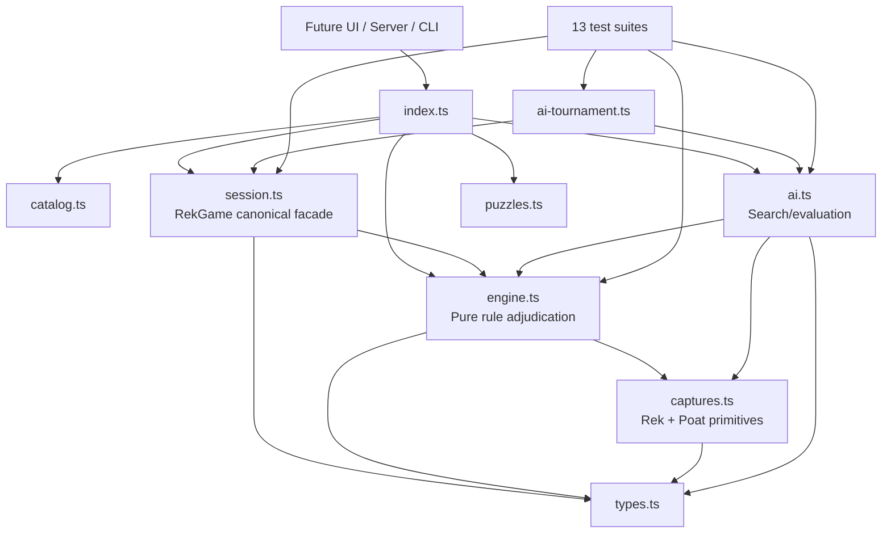
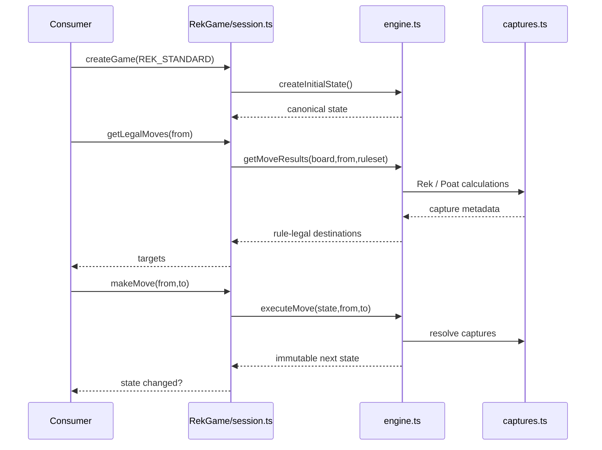
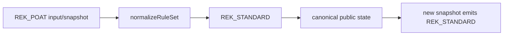
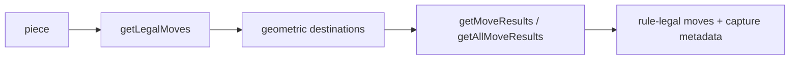
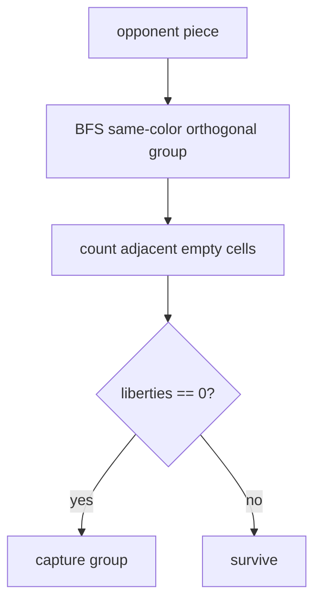
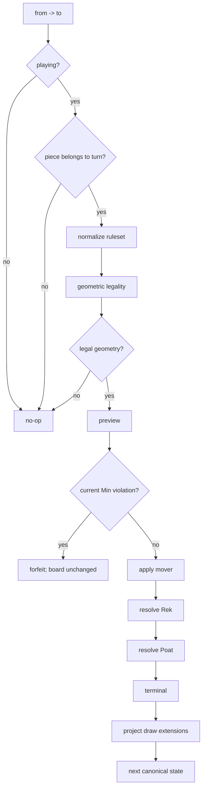

# SƠ ĐỒ GAME ENGINE REK KHMER

> **Repository:** `machxanht/Rek-Khmer-Chess`  
> **Ngày cập nhật:** 2026-09-06  
> **Mục tiêu:** mô tả kiến trúc engine sau khi chuẩn hóa Game / RuleSet / MatchType / AI Difficulty và ghi rõ boundary giữa historical evidence với current software contract.

---

## 1. Phân cấp khái niệm

Project chỉ có một game:

```text
Game = REK_KHMER
```

Core engine hỗ trợ hai canonical rulesets:

```text
RuleSet
├── REK_STANDARD
└── MIN_REK_CHANH
```

Compatibility alias:

```text
REK_POAT --normalize--> REK_STANDARD
```

Không phải ruleset:

```text
MatchType
├── LOCAL
├── VS_AI
├── ONLINE
└── AI_VS_AI

AiDifficulty
├── easy
├── medium
└── hard
```

Rek và Poat là mechanics. Hao Rek là transition-owned rule/state trong Min Rek Chanh, không phải game mode.

---

## 2. Repository/module graph hiện tại



### Trách nhiệm

| Module | Có trách nhiệm | Không được làm |
|---|---|---|
| `types.ts` | data types, canonical rulesets, compatibility input | capture adjudication |
| `catalog.ts` | game identity + presentation metadata | legality/capture |
| `captures.ts` | Rek/Poat primitives | turn/history/session |
| `engine.ts` | setup, movement, preview, execute, terminal/draw | UI/network |
| `session.ts` | canonical state, undo, snapshot validation/migration | duplicate capture logic |
| `ai.ts` | search trên engine-owned legal moves | tự định nghĩa legality |
| `ai-tournament.ts` | deterministic match harness + metrics | đổi rules |
| `puzzles.ts` | engine tactical fixtures | historical provenance tự động |
| future UI/server | render/transport/match lifecycle | duplicate core rules |

---

## 3. Canonical public path

Application code mới nên dùng `RekGame`:



UI/server không được tự quyết “move này Rek/Poat/Hao hợp lệ không?”.

---

## 4. Public API layering

### Canonical session facade

```text
session.ts -> RekGame
```

`RekGame` owns:

- canonical state exposure;
- undo;
- serialization/deserialization;
- legacy snapshot normalization;
- public rule-legal move projection.

### Legacy/secondary stateful wrapper

`engine.ts` còn export class `RekEngine` ngoài pure functions.

Audit 2026-09-06 phát hiện một semantic mismatch:

- `RekGame.makeMove()` có thể trả `true` khi a geometrically legal current-Min quiet move làm state chuyển sang forfeit loss;
- `RekEngine.makeMove()` cũng chuyển state sang loss nhưng trả `false` nếu preview thấy `isHaoRekViolation`.

Đây là **API technical debt**. New consumers phải ưu tiên `RekGame`. Không sửa wrapper trong docs-only pass này.

---

## 5. Ruleset normalization layer

```ts
type RuleSet = 'REK_STANDARD' | 'MIN_REK_CHANH'
type RuleSetInput = RuleSet | 'REK_POAT'
```



`createPositionKey()` normalize alias trước khi tạo repetition namespace.

Legacy `positionCounts` migrate `REK_POAT|` → `REK_STANDARD|` và merge counts.

---

## 6. Setup pipeline

```text
createGame()
  ↓
DEFAULT_RULESET = REK_STANDARD
  ↓
createInitialState()
  ↓
createInitialBoard()
  ↓
canonical 7 + King + 8
```

```text
8   ● ● ● ● ● ● ● .
7   . . . . . . . ♚
6   ● ● ● ● ● ● ● ●
5   . . . . . . . .
4   . . . . . . . .
3   ○ ○ ○ ○ ○ ○ ○ ○
2   ♔ . . . . . . .
1   . ○ ○ ○ ○ ○ ○ ○
```

Initial Kings luôn `a2` / `h7`. Custom puzzles có thể đặt King ở squares khác nhưng không đổi initial setup.

---

## 7. Move legality layers



### Geometry

- N/S/E/W sliding;
- empty squares only;
- stop at blocker;
- no jump/diagonal;
- current Min: King stationary.

### Rule legality

- Standard: geometric set remains available;
- current Min: state-aware legality consumes `haoRekContext.allowedResponses`;
- board-only move generation does not invent Hao from pre-existing Rek.

Consumer không dùng geometric set như final legal set.

---

## 8. Rek layer

```text
X | T | X
```

và vertical equivalent.

Current implementation union both axes, nên có thể capture 4.

Evidence boundary:

```text
two-sided pair capture = CONFIRMED
dual-axis => 4         = ENGINE INTERPRETATION / UNVERIFIED
```

Nếu future evidence bác Rek-4, thay đổi tập trung ở `captures.ts` + regression fixtures.

---

## 9. Poat layer



Evidence boundary:

- trapping/encirclement capture concept = confirmed;
- connected component + zero-liberties = engine interpretation;
- edge treatment = engine interpretation;
- timing after Rek = engine interpretation.

---

## 10. Current turn execution



---

## 11. `REK_STANDARD`

```text
REK_STANDARD
├── canonical setup
├── regular movement
├── Rek optional under current contract
├── Poat engine interpretation
└── King-capture terminal
```

Tên neutral, không tuyên bố “Rek Poat” là separate traditional mode.

---

## 12. `MIN_REK_CHANH`: Rek v1 architecture

Current engine model:

```text
previous GameState
   ↓
responder Rek set BEFORE
   ↓
execute opponent move
   ↓
responder Rek set AFTER
   ↓
NEW = AFTER - BEFORE
   ↓
NEW empty? -> no Hao context
NEW non-empty? -> persist active HaoRekContext.allowedResponses
   ↓
state-aware legal generation
   ↓
response / immediate forfeit
   ↓
derive next Hao context
```

This implements the strongest available event-trigger evidence while keeping unresolved historical edges as explicit technical policy.

---

## 13. Hao Rek state boundary

```ts
interface HaoRekContext {
  active: boolean
  createdByMove: { from: number; to: number } | null
  allowedResponses: { from: number; to: number }[]
}
```

Architectural consequences:

- board identity alone is insufficient for live legality;
- snapshots/replays persist Hao context;
- repetition identity includes active response set;
- session/API use state-aware legal projection;
- live AI/tournament consume full GameState;
- AI never derives Hao independently.

Current technical policies:

- responder may choose any NEW response;
- verbal speech state is not required;
- Poat-in-Min remains unchanged but historically unverified.

---

## 14. Terminal/draw boundary

Current order:

```text
King captured
  ↓
all enemy pieces gone
  ↓
zero geometric moves
  ↓
threefold
  ↓
lone-King limit
```

| Rule | Evidence status |
|---|---|
| King capture = win | strong/confirmed objective |
| zero-move instant win | unverified |
| threefold | project extension |
| lone-King default 32 | project extension |

Zero-move terminal reason is now `Opponent has no geometric moves`, intentionally separated from Poat/liberty terminology.

---

## 15. AI architecture

AI live path:

```text
GameState
   ↓
getAllStateMoveResults()
   ↓
engine-owned Hao/legal/capture metadata
   ↓
executeMove() for child states
   ↓
ordering/evaluation/minimaxState
```

Điểm tốt:

- AI không duplicate movement/Rek/Poat;
- exact capture metadata được reuse;
- deterministic Medium/Hard regression;
- tournament uses `RekGame` for actual state transitions.

Live state-aware search now carries Hao context plus repetition/lone-King draw history through engine-owned GameState transitions. Board-only AI helpers remain compatibility/baseline utilities.

---

## 16. Puzzle architecture

`puzzles.ts` hiện là **engine tactical fixtures**, không phải database đã chứng minh provenance truyền thống.

Một số fixture phụ thuộc:

- BFS zero-liberties Poat;
- Rek→Poat ordering;
- custom King placements;
- descriptive tactical names.

Future UI phải label đúng “engine training/tactical fixture” trừ khi từng puzzle có nguồn Khmer độc lập.

---

## 17. Test/CI architecture

`npm run test:engine` compile và chạy 13 report groups, gồm core/spec/AI/state/draw/puzzle/simulation/tournament/API locks.

Rek v1 freeze checkpoint: **109/109 PASS**.

CI engine workflow chạy khi paths thay đổi trong:

- `lib/rek-engine/**`;
- `scripts/**`;
- `package.json`;
- `tsconfig.json`;
- workflow itself.

CI path coverage includes canonical rule/spec/architecture docs and `RESEARCH_*.md`, so research-contract changes trigger the same engine Quality Gate.

---

## 18. Recommended future application split

```text
Core
├── RuleSet: REK_STANDARD | MIN_REK_CHANH
└── CanonicalGameState

Application
├── MatchType: LOCAL | VS_AI | ONLINE | AI_VS_AI
├── AiDifficulty: easy | medium | hard
├── presentation/i18n/audio
└── networking/replay storage
```

Core không cần biết human/AI/network.

---

## 19. Safe rule-change flow

```text
Khmer evidence / reconstructable board event
        ↓
RESEARCH_HAO / RESEARCH_LUAT
        ↓
HUONG_DAN confidence promotion
        ↓
SPEC technical contract
        ↓
new failing regression fixture
        ↓
core engine
        ↓
session/snapshot migration if needed
        ↓
AI/tournament verification
```

Không dùng app store làm source. Không sửa UI/AI để “bắt chước” rule future trước core.