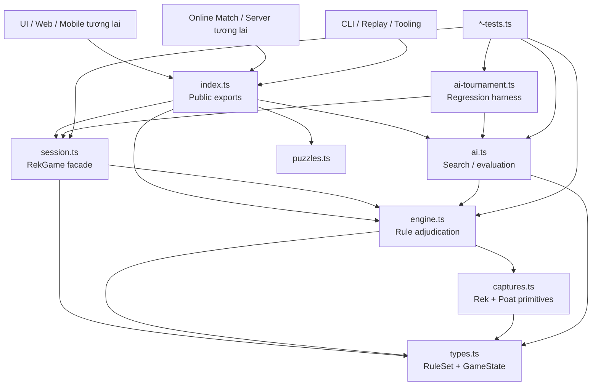
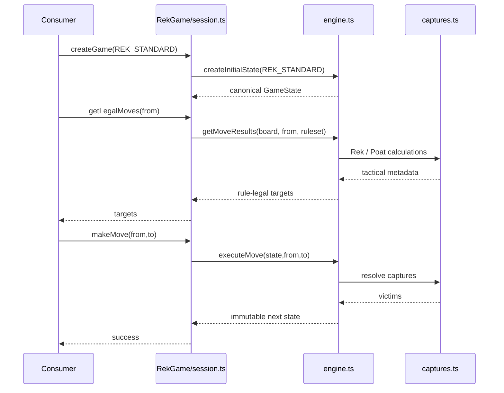
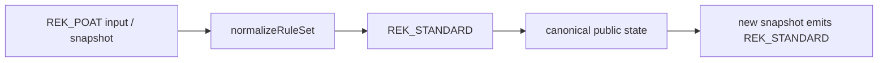
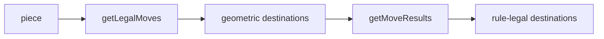
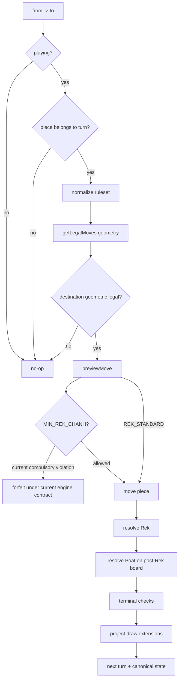
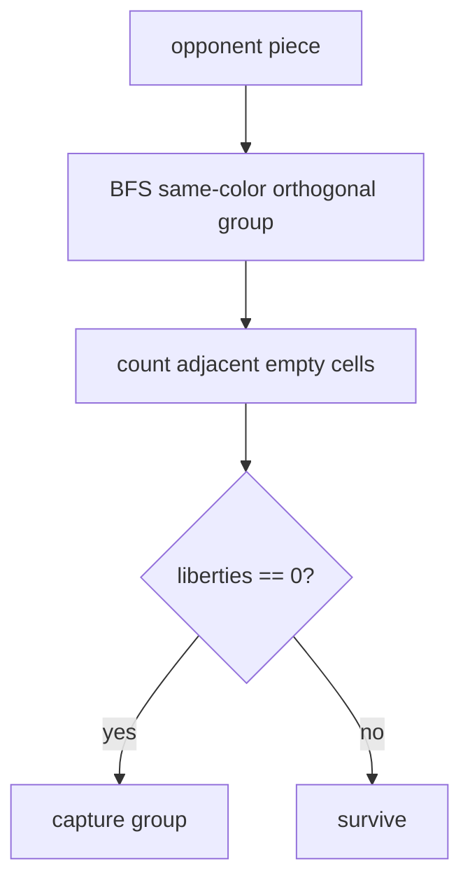
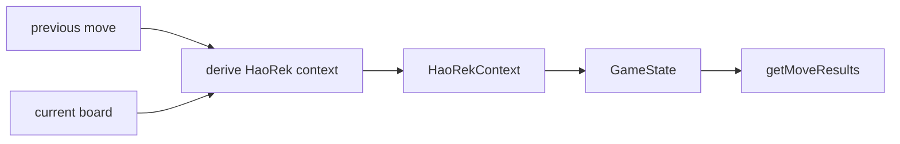

# SƠ ĐỒ GAME ENGINE REK KHMER

> **Repository:** `machxanht/Rek-Khmer-Chess`  
> **Mục tiêu:** mô tả kiến trúc engine sau khi chuẩn hóa khái niệm **Game / RuleSet / MatchType / AI Difficulty**.

---

## 1. PHÂN CẤP KHÁI NIỆM

Project chỉ có một game:

```text
Game = REK_KHMER
```

Core engine hiện hỗ trợ hai rule set:

```text
RuleSet
├── REK_STANDARD
└── MIN_REK_CHANH
```

`REK_POAT` là compatibility alias cũ:

```text
REK_POAT  --normalize-->  REK_STANDARD
```

Những thứ sau **không phải rule set**:

```text
MatchType
├── LOCAL
├── VS_AI
├── ONLINE
└── AI_VS_AI

AiDifficulty
├── easy
├── medium
└── hard
```

Match type thuộc application/server layer. Difficulty thuộc AI layer. Không đưa chúng vào core rule adjudication.

---

## 2. MODULE GRAPH



### Trách nhiệm

| Module | Có trách nhiệm | Không được làm |
|---|---|---|
| `types.ts` | Data types, `RuleSet`, legacy aliases | Không phán capture |
| `captures.ts` | Rek/Poat primitive | Không quản turn/history |
| `engine.ts` | setup, movement, preview, execute, terminal | Không quản UI/network |
| `session.ts` | state, undo, snapshot migration | Không tự viết capture rule |
| `ai.ts` | search trên legal set từ engine | Không tự định nghĩa legality |
| `ai-tournament.ts` | AI match harness + metrics | Không đổi rule |
| UI/server | input/output, match lifecycle | Không duplicate engine rule |

---

## 3. PUBLIC CALL FLOW

Consumer nên dùng `RekGame`:



UI/server chỉ render/transport. Nếu UI tự quyết “nước này Rek được không?” thì architecture đã bị phá.

---

## 4. RULESET NORMALIZATION LAYER

`types.ts` expose:

```ts
type RuleSet = 'REK_STANDARD' | 'MIN_REK_CHANH'
type LegacyGameMode = 'REK_POAT'
```

Compatibility path:



`createPositionKey()` cũng normalize alias trước khi tạo repetition key. Vì vậy:

```text
REK_POAT|you|...
REK_STANDARD|you|...
```

không được coi là hai position khác nhau.

Legacy snapshot `positionCounts` được migrate bằng cách đổi namespace `REK_POAT|` → `REK_STANDARD|` và merge count nếu cần.

Snapshot schema vẫn version 1 vì migration là backward-compatible.

---

## 5. SETUP PIPELINE

```text
createGame()
   ↓
DEFAULT_RULESET = REK_STANDARD
   ↓
createInitialState()
   ↓
createInitialBoard()
   ↓
canonical 7 + King + 8 setup
```

Setup dùng chung cho `REK_STANDARD` và `MIN_REK_CHANH`:

```text
8   ● ● ● ● ● ● ● .
7   . . . . . . . ♚
6   ● ● ● ● ● ● ● ●
5   . . . . . . . .
4   . . . . . . . .
3   ○ ○ ○ ○ ○ ○ ○ ○
2   ♔ . . . . . . .
1   . ○ ○ ○ ○ ○ ○ ○
```

---

## 6. MOVE LEGALITY LAYER

Hai tầng legality phải được giữ riêng:



### `getLegalMoves()`

- scan North/South/East/West;
- chỉ đi qua empty square;
- stop tại blocker đầu tiên;
- destination không occupied;
- current `MIN_REK_CHANH` contract: King stationary.

### `getMoveResults()`

- dùng geometric candidates;
- preview từng move;
- current Min contract lọc quiet moves nếu compulsory-Rek condition active;
- trả `MoveResult` có Rek/Poat metadata.

Consumer không được dùng geometric set như final legal set.

---

## 7. TURN EXECUTION PIPELINE



Phần nào “current engine contract” nhưng chưa historical-confirmed phải được giữ nguyên label đó trong docs/tests.

---

## 8. REK LAYER

`checkRekCaptures()` kiểm hai trục độc lập quanh landing square:

```text
Horizontal
X | T | X

Vertical
X
|
T
|
X
```

Current implementation union cả hai trục, nên có thể bắt 4.

Evidence boundary:

```text
capture opposite pair        = CONFIRMED core principle
dual-axis => 4 captures      = UNVERIFIED / engine interpretation
```

Nếu research sau này bác Rek-4, thay đổi tập trung ở `captures.ts` + tests; không cần viết lại session/UI/AI.

---

## 9. POAT LAYER

Current implementation:



Evidence boundary:

- vây/bí dẫn tới capture: strong/confirmed principle;
- connected-component semantics: strong interpretation;
- exact BFS/liberty formula: engine interpretation;
- exact timing sau Rek: engine interpretation.

---

## 10. `REK_STANDARD`

Canonical default:

```text
REK_STANDARD
├── canonical setup
├── core movement
├── optional Rek under current contract
├── Poat implementation
└── King-capture terminal
```

Tên này cố ý trung tính. Nó không tuyên bố rằng “Rek Poat” là một historically proven separate mode.

---

## 11. `MIN_REK_CHANH`

Current engine model:

```text
board + current player
    ↓
getAllRekOpportunities()
    ↓
any Rek exists?
    ├── no  -> ordinary geometric moves remain
    └── yes -> only Rek moves remain rule-legal
               quiet submitted move => forfeit
```

Đây là điểm research quan trọng nhất.

Nếu exact Hao Rek phụ thuộc previous move/call/target pair, architecture tương lai nên thêm explicit context:

```ts
interface HaoRekContext {
  active: boolean
  createdByMove: { from: number; to: number } | null
  targetPairs: number[][]
  allowedResponses?: { from: number; to: number }[]
}
```

Possible flow:



**Không implement context này cho đến khi research xác nhận semantics.**

---

## 12. TERMINAL / DRAW

Current terminal order về cơ bản:

```text
King captured
  ↓
all pieces gone
  ↓
zero geometric moves
  ↓
threefold repetition
  ↓
lone-King limit
```

Evidence status:

| Rule | Status |
|---|---|
| King capture = win | CONFIRMED |
| zero-move instant win | UNVERIFIED |
| threefold | PROJECT EXTENSION |
| lone-King default 32 | PROJECT EXTENSION |

AI hiện search theo current engine contract, không phải theo “research future contract”. Khi terminal semantics đổi, AI regression phải đổi cùng core engine.

---

## 13. MATCH TYPE TƯƠNG LAI

Application layer có thể thiết kế:

```text
Choose RuleSet
├── REK_STANDARD
└── MIN_REK_CHANH

Then Choose MatchType
├── LOCAL
├── VS_AI
│   ├── easy
│   ├── medium
│   └── hard
├── ONLINE
└── AI_VS_AI
```

Core engine không cần biết human/AI/network.

---

## 14. SAFE RULE-CHANGE FLOW

```text
Khmer evidence / real-board sequence
        ↓
HUONG_DAN_LUAT_CO_REK_KHMER.md
        ↓
confidence promoted?
        ↓ yes
SPEC_ENGINE_CO_REK_KHMER.md
        ↓
regression fixture
        ↓
core engine
        ↓
session / AI / tournament consume new contract
```

Không sửa UI trước engine. Không sửa AI để “bắt chước rule” trước core. Không dùng app store làm source.
